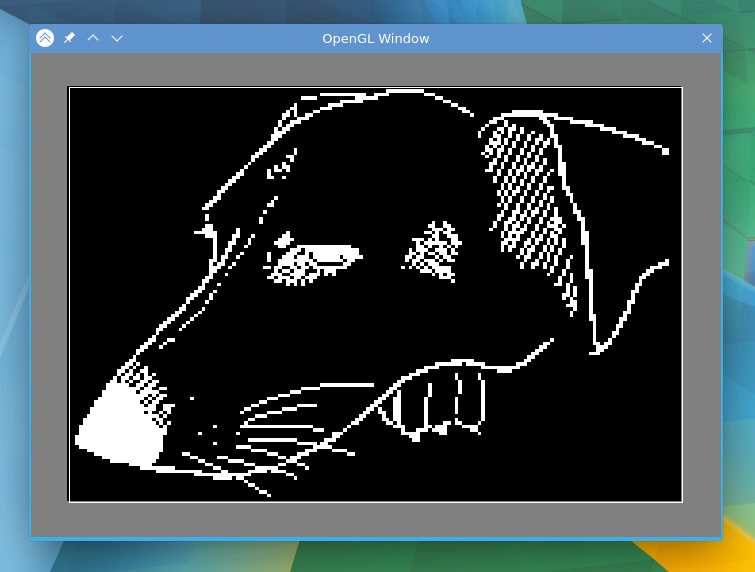

# CPEN311 - OpenGL Debugging

A useful debugging tool for versions of the UBC CPEN 311 course that offer the Pixel Transformation Lab.



It's an OpenGL program that allows for easy visualization of graphics algorithms before they turned into hardware.  
It also generates framebuffer test data in the .memh format used by ModelSim allowing the results to be incorporated into a testbench.

## Building

This program utilizes freeglut which Mesa depends on. So if you have Mesa installed, you're probably all set.  
I haven't tried porting it to Windows yet.  
The build, run the following commands:
```bash
git clone https://github.com/anotida01/cpen311_opengl
cd cpen311_opengl/
make all
```
## Usage

Graphics algorithms are implemented in [algorithms.c](algorithms.c). Follow the examples in that file to add new algorithms.

When running the executable, pass the function number as a parameter
```bash
./cpen311_opengl 2 #this will run the 2nd registered function
```

Custom runtime parameters (to the algorithm) are not supported.
